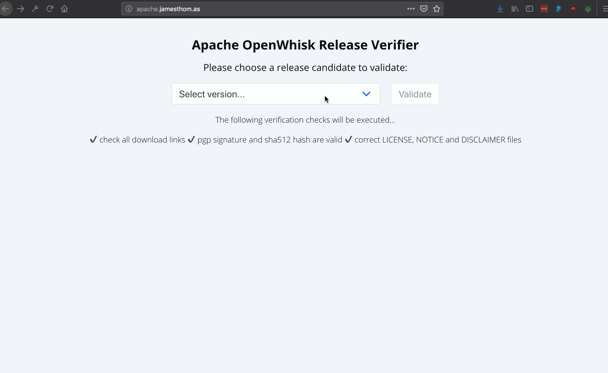

## Apache OpenWhisk Release Candidate Verification Tool

[](https://travis-ci.org/jthomas/openwhisk-release-verification)

This tools helps to verify release candidates for the Apache OpenWhisk project.



**Live version running at http://apache.jamesthom.as**

It automatically runs the following verification steps from the [release checklist](https://cwiki.apache.org/confluence/display/OPENWHISK/How+to+verify+the+release+checklist+and+vote+on+OpenWhisk+modules+under+Apache). 

- **Download links are valid.**
- **Checksums and PGP signatures are valid.**
- **DISCLAIMER, LICENSE and NOTICE files are included and correct.**

The tool is a web application composed of a static web site (running on Github pages) and Apache OpenWhisk actions (running on IBM Cloud Functions). Actions run all verification steps in the backend.

## running

### install project dependencies

```
npm install serverless -g & npm install 
```

This tool uses [The Serverless Framework](https://serverless.com/) to configure the Apache OpenWhisk resources. Refer to the [documentation](https://github.com/serverless/serverless-openwhisk) for this project to configure the Apache OpenWhisk provider to use. 

*p.s. [IBM Cloud Functions](https://cloud.ibm.com/openwhisk) provides free instances of Apache OpenWhisk in multiple public cloud regions. Sign up for a free account here: https://cloud.ibm.com/registration* 😎

### deploy backend

```
sls deploy
```

This will create the actions exposed as the following API endpoints.

- `GET /api/versions` - return list of release candidates from [here](https://dist.apache.org/repos/dist/dev/incubator/openwhisk/).
- `GET /api/versions/{version}` - return release candidate file list.
- `GET /api/versions/{version}/validate` - validate release candidate.

### configure frontend

Replace `API_ENDPOINT` in `index.html` with API Gateway endpoint path for the backend.

### run web server

Host the `index.html` and `index.css` static web files on a web server, e.g. using Python locally.

```
python -mSimpleHTTPServer
```

## issues / feedback / comments?

Please open an issue in the repo. PRs welcome obviously 😜...
